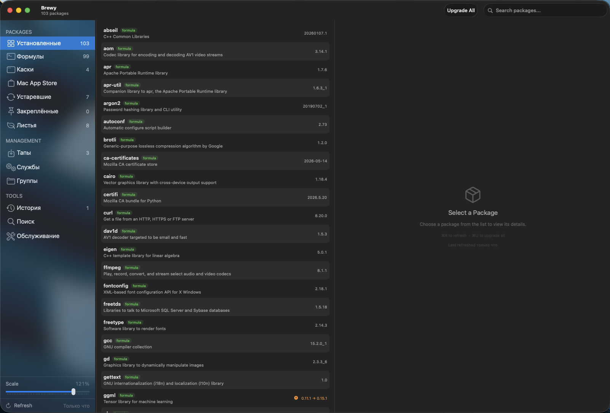

# FluentBrewy

<p align="center"></p>

[](LICENSE)

FluentBrewy is a Windows 10 Fluent-inspired fork of [starhaven-io/Brewy](https://github.com/starhaven-io/Brewy), a native macOS GUI for managing [Homebrew](https://brew.sh) packages.

This fork keeps Brewy's Homebrew package-management features and focuses on a sharper Fluent-style interface: Acrylic sidebar, square corners, Windows 10-style icons and typography, Russian localization, scalable UI, and resizable columns.



## What Changed In This Fork

- Windows 10-style Fluent sidebar with Acrylic material.
- Square-corner sidebar selection instead of native macOS rounded sidebar rows.
- Custom three-column layout replacing the native `NavigationSplitView` sidebar container.
- Monochrome outline sidebar icons inspired by Windows 10 navigation glyphs.
- Fluent font helper using Segoe UI when available, with macOS fallback.
- Russian and English language switcher.
- Interface scale slider in the sidebar footer.
- Resizable sidebar and content columns with resize cursor affordance.
- Transparent window setup so the sidebar Acrylic can sample the desktop behind the app.

## Core Features

- Browse installed formulae, casks, Mac App Store apps, pinned packages, leaves, and outdated packages.
- Search Homebrew formulae and casks.
- Install, uninstall, upgrade, reinstall, pin, unpin, fetch, link, and unlink packages.
- Upgrade all outdated packages or selected outdated packages.
- View package details, dependencies, and dependency trees.
- Manage taps, including tap health checks for archived, moved, or missing repositories.
- Manage Homebrew services.
- Organize packages into custom groups.
- Review action history and retry failed actions.
- Run maintenance actions such as `brew doctor`, cleanup, autoremove, and cache cleanup.
- Use dry-run previews for cleanup and autoremove operations.
- Configure brew path, auto-refresh interval, theme, and language.
- Sparkle auto-update support inherited from upstream Brewy.

## Requirements

- macOS 14.0 or later.
- Apple Silicon or Intel Mac.
- [Homebrew](https://brew.sh) installed.
- Xcode 16 or later for building from source.

## Build From Source

```sh
git clone https://github.com/DurkaEbanaya/FluentBrewy.git
cd FluentBrewy
open Brewy.xcodeproj
```

Then build and run from Xcode with `Cmd+R`.

## Upstream

FluentBrewy is based on [starhaven-io/Brewy](https://github.com/starhaven-io/Brewy).

Upstream Brewy is licensed under AGPL-3.0-only and remains the source of the package-management architecture, Homebrew integrations, Sparkle support, and core app behavior.

## License

This project is licensed under the [GNU Affero General Public License v3.0](LICENSE) (`AGPL-3.0-only`).

Original copyright:

Copyright (C) 2026 Patrick Linnane
